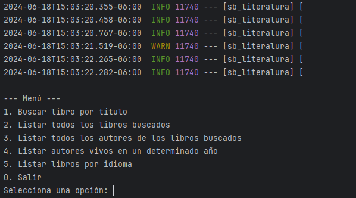
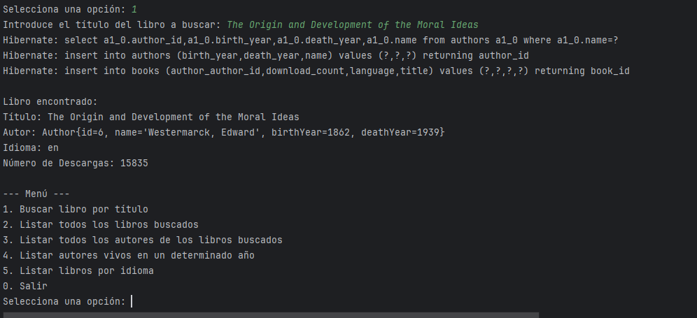
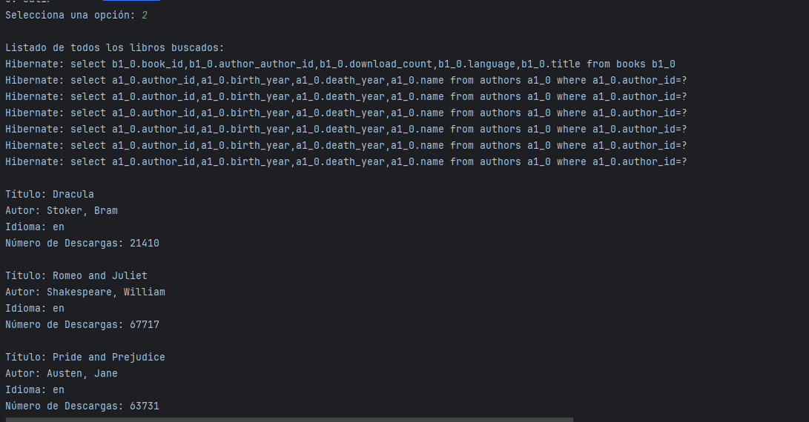
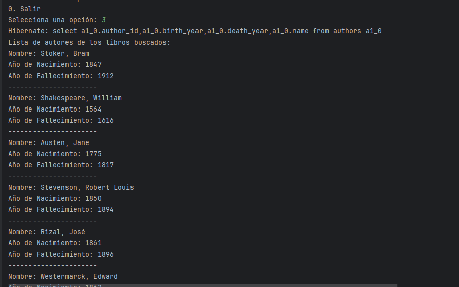
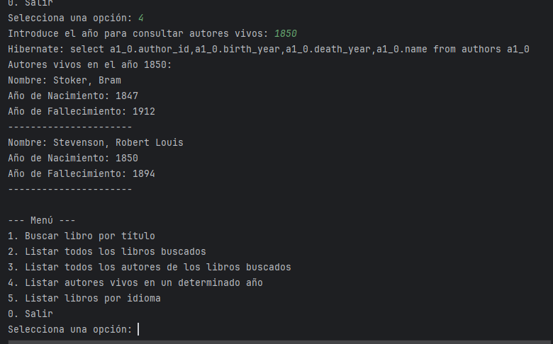
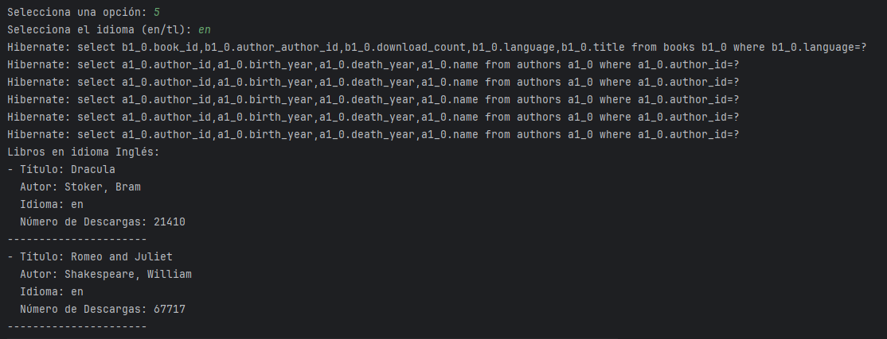
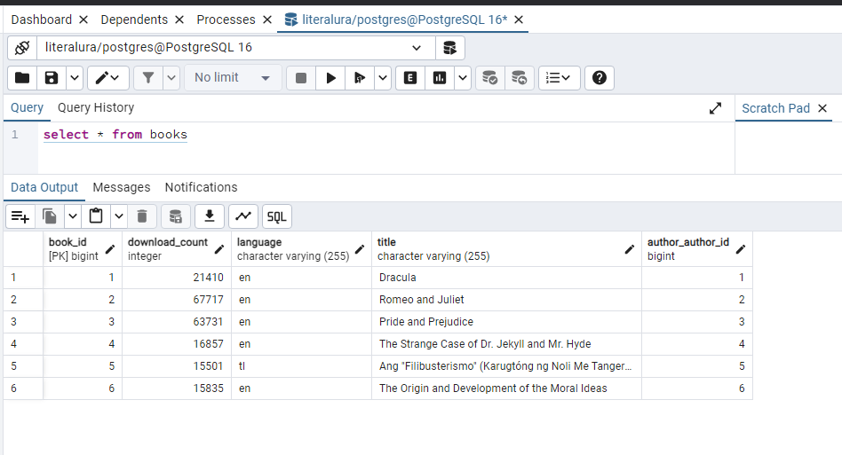
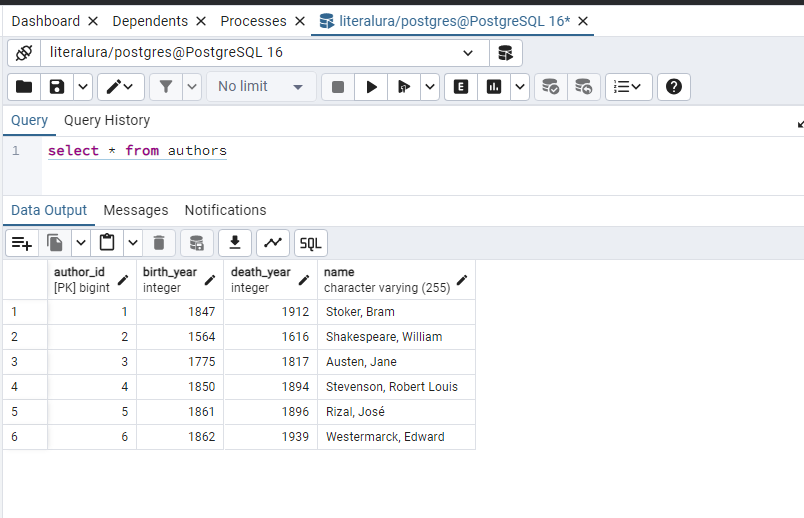

# Resumen del Proyecto SbLiteralura

## Descripción del Proyecto

El proyecto **SbLiteralura** es una aplicación de consola desarrollada en Java utilizando Spring Boot. La aplicación interactúa con la API de Gutendex para buscar libros por título y almacenar información sobre los libros y sus autores en una base de datos.

### Funcionalidades Principales

- **Buscar Libro por Título**: Permite al usuario buscar un libro por su título, consulta la API de Gutendex y almacena el libro y su autor en la base de datos.
  
- **Listar Libros y Autores**: Muestra todos los libros y autores almacenados en la base de datos.
  
- **Listar Autores Vivos en un Año**: Muestra los autores que estaban vivos en un año específico basado en su año de nacimiento y muerte.

- **Listar libros por idiomas**: Muestra todos los libros basado en el filtro de idioma, seleccionando 1 de los 2 disponibles (en/tl).

### Tecnologías Utilizadas

- Java
- Spring Boot
- Spring Data JPA
- Jackson (para el manejo de JSON)
- PostgreSQL (base de datos relacional)

## Resultados

